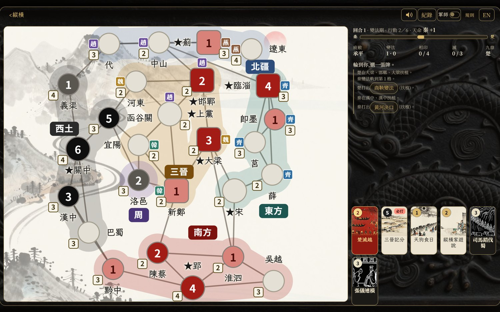
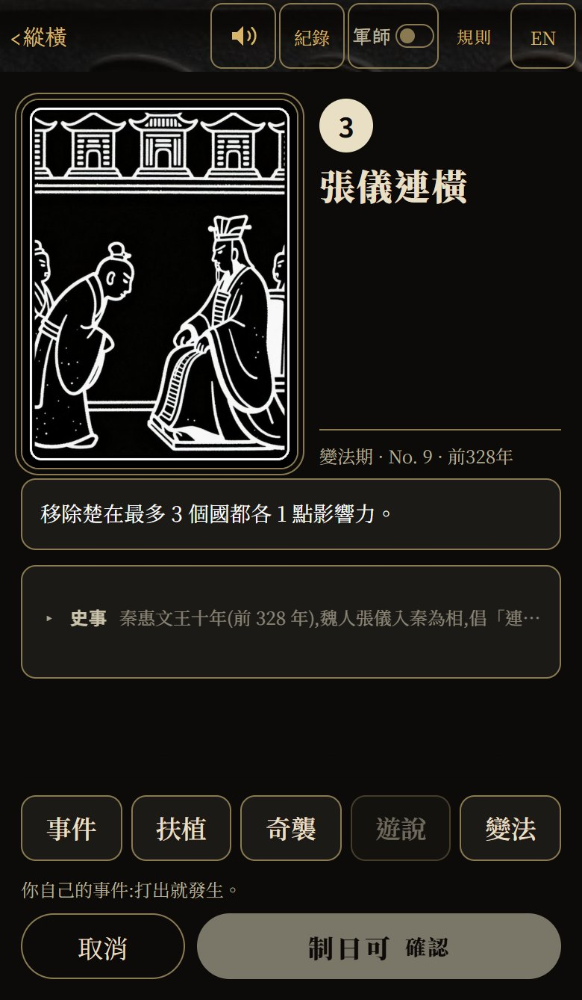
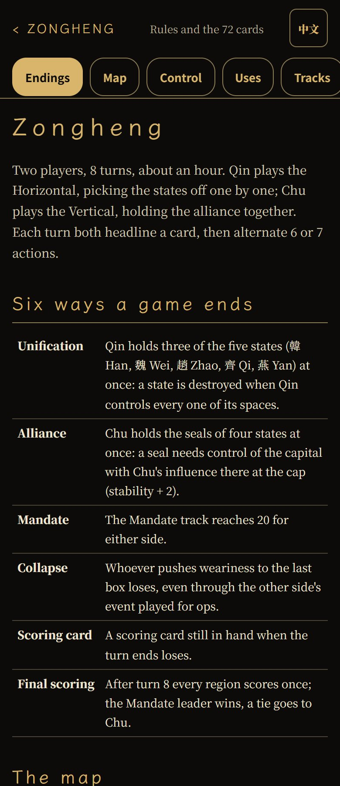
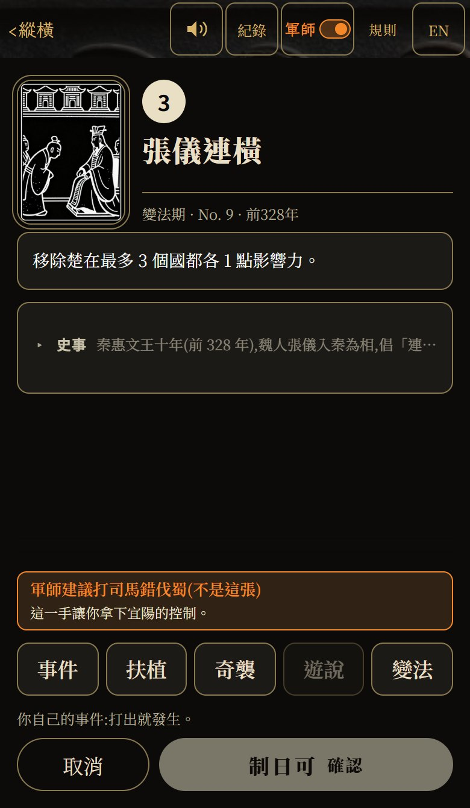
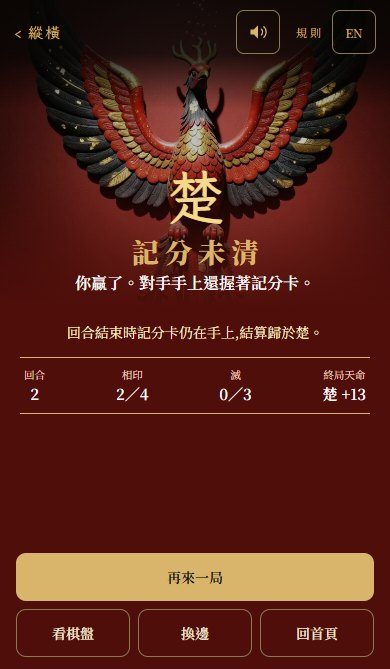
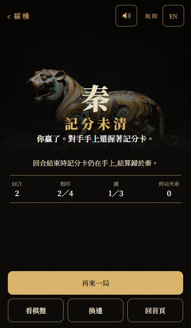

# 〔遊戲開發日記〕縱橫：秦滅六國，還是六國合縱?

## 函谷關外

周天子還在，只是沒人聽他的了。

洛邑城裡那九隻鼎，據說是大禹收九州之金鑄的。誰扛得動，誰就有天命。前些年楚莊王北上，路過周室的地界，開口就問鼎有多大、有多重——問鼎中原這句話，就是這麼來的。

關中，秦王在燈下看地圖。張儀說，跟遠的齊國交好，先吃近的韓魏，一城一城地啃，這叫連橫。

郢都，楚王也在看同一張地圖。蘇秦說，六國的土地是秦的五倍，只要合起來，函谷關以東誰都動不了，這叫合縱。

一邊要把六國一個一個吞掉，一邊要把六國一條線綁起來。

這盤棋，你想坐哪一邊?

## 怎麼玩

《縱橫》是兩人對弈的卡牌戰略遊戲。一邊是秦，一邊是楚（帶著六國）。八個回合，大約一小時。

每一張牌都是一段史實：商鞅變法、司馬錯伐蜀、長平之戰、五國伐秦、廉頗與李牧、墨者守城……

輪到你，選一張牌，然後決定怎麼用它。一張牌有五種用法：

- **事件**：照牌面上寫的做。歷史怎麼發生，它就怎麼發生。
- **扶植**：在地圖上鋪自己的影響力，一點一點把城拿下來。
- **奇襲**：不管遠近，打掉對方在某座城的影響力，剩下的變成自己的。但打要衝會讓天下更累。
- **遊說**：不動刀兵，靠周邊的形勢把對方的人拔掉。
- **變法**：把這張牌丟掉，換國力往前一格。

麻煩的地方在這裡：**牌不一定是你的**。抽到「合縱攻秦」的可能是秦王。你可以用它的行動點，但那件史事還是會發生——你只能選它先發生，還是你先動。

還有一條共用的疲敝軌：承平、兵連、禍結、民困、土崩。每打一次要衝，它就往前一格。誰把它推到土崩，誰當場輸掉。所以想打的時候要想一下，這一下是不是把自己也推下去。

秦要滅三個國就贏。楚要拿到四個相印就贏。天命軌先到 20 也贏。八回合結束，看天命誰多。

## 玩遊戲學歷史

這才是我做這個的第一個原因。

我以前讀戰國，讀完只記得「合縱連橫」四個字，誰縱誰橫都要想一下。但是把它做成遊戲以後，事情就不一樣了。

你會知道**函谷關為什麼重要**——因為你每次想從東邊打進關中，那張「函谷關天險」都讓你少兩點行動點，痛到你記得。

你會知道**遠交近攻是什麼意思**——因為你自己算過，打隔壁的韓國是拿地，打最遠的齊國是幫別人拿地。

你會知道**九鼎為什麼是權力的象徵**——因為在遊戲裡它是最強的一張牌，用完還得蓋起來交給對手，下回合換他用。這東西不屬於誰，誰扛得動就是誰的。

你也會知道**趙國為什麼難吃**——它有四座城，還有一座中山在北邊，滅趙要全吃下來，長平打完也還沒完。

每張牌翻開都有一段「史事」，寫那件事情實際上怎麼發生的。打完一局，戰國那些人名和地名就不再是課本上並列的名詞了，它們是你剛剛為了它們吵過架的東西。

我小孩還太小，不過我已經在想，等他們大一點，這會不會比背年表有用一點。

## 為什麼是《縱橫》

《冷戰熱鬥》（Twilight Struggle）在 BGG 上排名長年在前段，兩個人、一張世界地圖、美蘇冷戰四十年。它是我一直很想學好的遊戲。

可惜一直沒有機會好好玩一場。印象中只跟 camel 玩了半場，後來就不了了之 XD

問題其實不在遊戲，在**人**。這種遊戲一場要三小時，要對手、要時間、要兩個人都熟規則。三個條件湊齊一次，很難。

那如果對手可以是 AI 呢?

於是就有了《縱橫》：規則的骨架跟《冷戰熱鬥》同一脈——卡牌驅動、事件是雙面刃、一張牌只能用一種用法、共用的末日軌——但是換成戰國七雄，時間壓到一小時，而且隨時都有對手。

它現在有一個電腦對手（三種強度），也可以開房間找朋友一起玩。

還有一個「軍師」模式：打開它，軍師會告訴你這一手該打哪張牌、該做什麼、為什麼。對第一次玩的人，這比讀規則書快得多。第一次玩就照著軍師打，玩個兩三局再自己想。

## 後話

這個遊戲是用 Claude Code 寫的，Cloudflare Workers + Durable Objects 上線，圖是本機 ComfyUI 生的。

有幾個數字：

- 目前 **213 個自動測試**，每次上線前跑一次。
- 規則引擎和畫面是分開的，所以可以讓**電腦自己跟自己玩**。改規則之前先跑 **6000 局**看勝率。
- 最近就改了一條：影響力能放在哪裡，原本是「自己控制的城旁邊」，改成《冷戰熱鬥》的寫法「有自己影響力的城旁邊，而且能放哪裡在行動開始時就決定」。跑完模擬，秦的勝率從 **44.6% 變成 49.1%**（誤差範圍 1.4 到 7.6）。本來偏楚，現在差不多五五開。

  這件事我自己想不出來。是跑出來的。

- 做的方式也有點不一樣：我當「那個開規格的人」，實際寫程式的是好幾個 AI，一人一個分支，寫完我再開另一個 AI 去驗——跑測試、量畫面、故意把修正拿掉看測試會不會變紅。**驗的那個不修東西，修的那個不驗自己。** 這樣至少有一次是有人真的去看過的。

  這招很有用。這幾天抓到的問題裡，有一半是驗的那個抓出來的，包括一個「修好了但其實沒生效」的 CSS——原始碼是對的，畫面上沒變。

老實說，AI 寫的東西不能盡信。它會告訴你修好了，但沒有真的去看。所以我現在的規矩是：**要嘛有測試會變紅，要嘛我自己看過截圖，否則不算修好。**

還有很多沒做完：牌不夠多、電腦對手還不夠聰明（它會下，但不會設局）、歷史的部分還可以再寫深一點。

不過已經可以玩了。有錯請多指正 :p

**[怎麼玩（規則）](https://games.csiesheep.com/zongheng/rules)** ｜ **[入局](https://games.csiesheep.com/zongheng/)**
